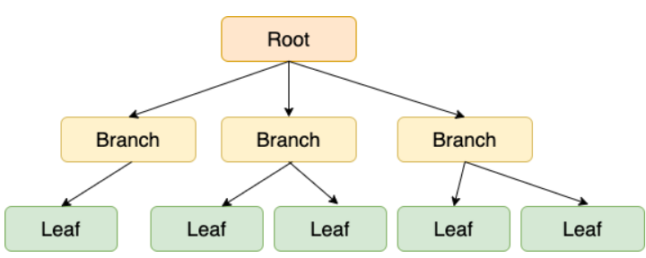
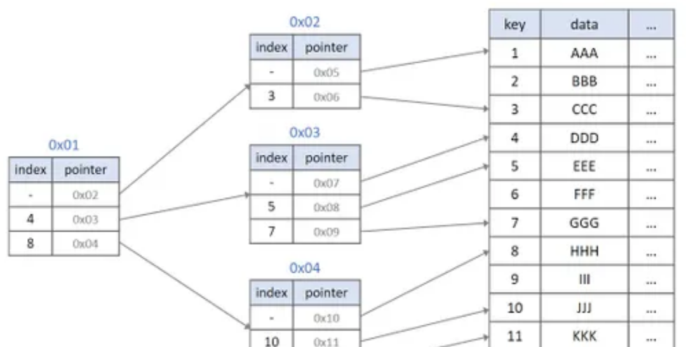

# B-Tree / B+Tree 

이진트리가 균형적일 때 탐색에 성능이 좋다는 특징을 이용한 자료구조

#### B Tree

데이터베이스, 파일 시스템에서 널리 사용되는 트리 자료구조의 일종이다.

이진트리를 확장해 하나의 노드가 가질 수 있는 자식 노드의 최대 숫자가 2보다 큰 트리 구조이다. 

- 모든 리프노드의 레벨이 같게 유지한다.
- 각 노드의 자료는 정렬된 상태여야함
- 입력 자료는 중복 될 수 없음

#### B+Tree

B-Tree는 탐색할 때 마다 root부터 탐색하며 접근해야 한다. 이를 개선 한 것이 B+Tree

내부 노드에 데이터를 담지 않고 leaf에만 데이터를 담고 이를 모두 연결리스트로 만들어

순차 접근시 시간에서 우위를 가질 수 있다. 

