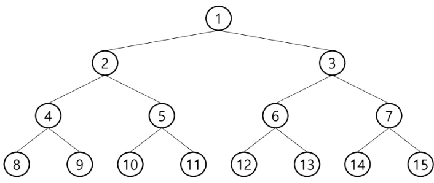

# Tree

#### 개념

원소들 간에 1:n의 관계를 가지며 사이클이 존재하지 않는 자료구조

- 노드(node)

  - 차수: 노드에 연결된 자식 노드의 수
  - 높이(레벨): 루트 노드에서 노드에 이르는 간선의 수

- 간선(edge)

  

#### 이진트리

모든 노드들이 최대 2개의 서브트리를 갖는 특별한 형태의 트리

- 포화 이진 트리 : 모든 레벨에 노드가 포화상태로 차 있는 이진 트리

  

- 완전 이진 트리 : 노드 수가 n개 일 때, 1번부터 n번까지 빈 자리가 없는 이진트리

  

- 편향 이진 트리: 높이 h에 대한 최소 개수의 노드를 가지면서 한쪽 방향의 자식 노드만을 가진 이진트리

  

#### 순회

- 전위순회: **부모노드** - 왼쪽 자식노드 - 오른쪽 자식노드

  ```python
  def preorder(self):
          def _preorder(node):
              print(node.item, end=' ')
              if node.left:
                  _preorder(node.left)
              if node.right:
                  _preorder(node.right)
          _preorder(self.root)
  ```

- 중위순회: 왼쪽 자식노드 - **부모노드** - 오른쪽 자식노드

  ```python
  def inorder(self):
      def _inorder(node):
          if node.left:
              _inorder(node.left)
          print(node.item, end=' ')
          if node.right:
              _inorder(node.right)
      _inorder(self.root)
  ```

- 후위순회: 왼쪽 자식노드 - 오른쪽 자식노드 - **부모노드**

  ```python
  def postorder(self):
      def _postorder(node):
          if node.left:
              _postorder(node.left)
          if node.right:
              _postorder(node.right)
          print(node.item, end=' ')
      _postorder(self.root)
  ```

  

